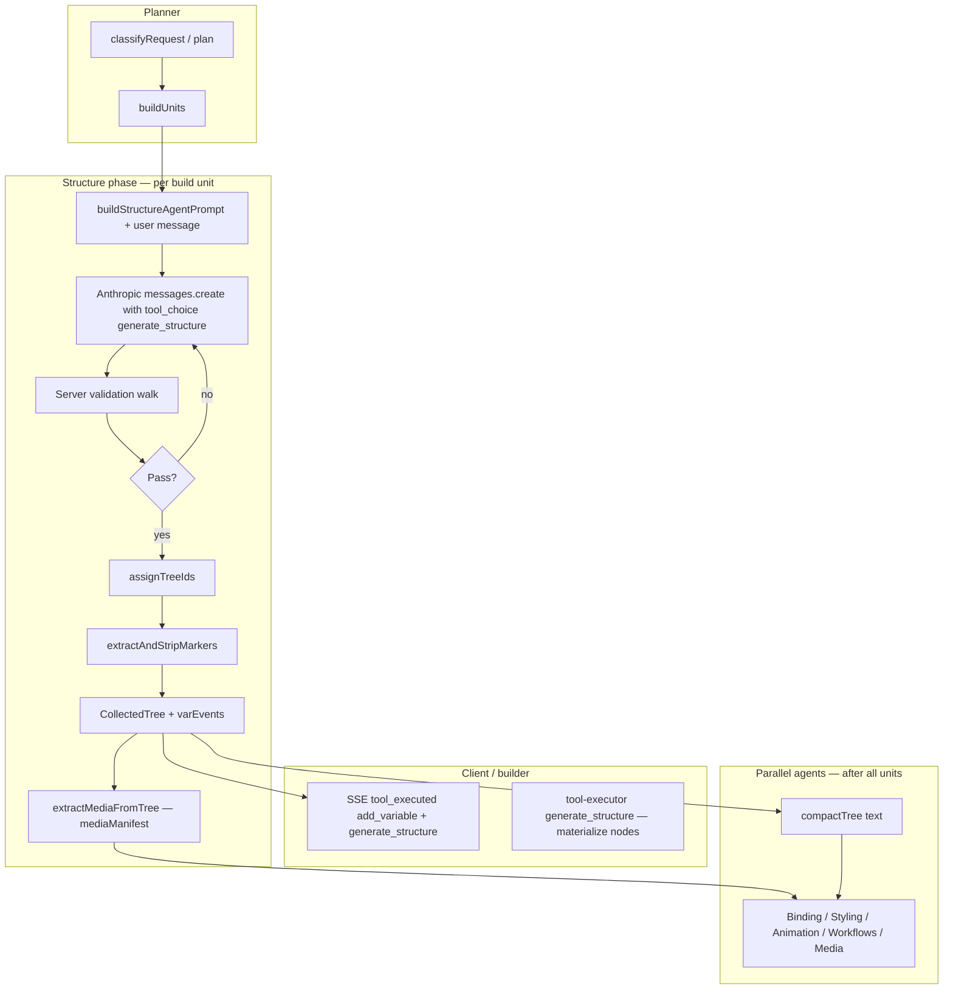
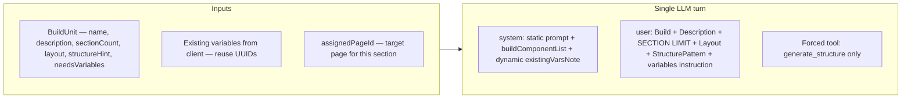
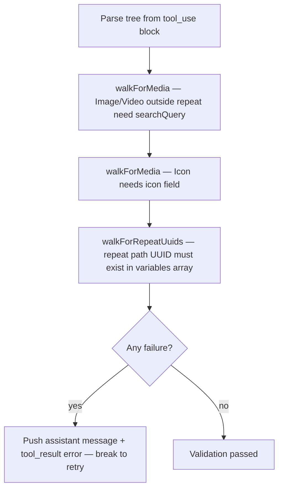

# Structure Agent — End-to-End Flow

This document describes how the **structure agent** works in the AI builder: inputs, server-side validation, outputs, and how those outputs feed the rest of the build pipeline.

## Where it lives

| Piece | Location |
|-------|----------|
| System + user prompt | [`lib/ai/agents/structure/prompt.ts`](../lib/ai/agents/structure/prompt.ts) |
| Orchestration (LLM call, retries, ID assignment, variables) | [`app/api/ai/builder-chat/route.ts`](../app/api/ai/builder-chat/route.ts) — `runStructureAgent` |
| Tool schema | [`lib/ai/builder-tools.ts`](../lib/ai/builder-tools.ts) — `generate_structure` |
| Client execution (materialize tree → page store) | [`lib/ai/tool-executor.ts`](../lib/ai/tool-executor.ts) — `handlers['generate_structure']` |

---

## High-level flow



---

## 0. When "build" mode triggers

The planner (`PLAN_SYSTEM` in `lib/ai/builder-knowledge-v2.ts`) classifies requests as `"build"` when:
- User provides a structured list of 2+ sections with `[PageName] Section: description` format
- User uses explicit build language: "build the app", "build the page", "build these sections"
- User wants a new page

It classifies as `"edit"` only for small single changes (one color, one text edit, one component).

`"build"` mode triggers the full parallel pipeline below — even when all sections target an existing page (e.g. `pageRoute: "/"` for the homepage). The page ID map correctly routes all sections to the current page when `unit.pageRoute === '/'`.

---

## 1. Inputs to the structure agent



- **Model:** `claude-haiku-4-5` (see `runStructureAgent`).
- **No read tools:** The structure agent does not call `get_page_tree`; it emits one `generate_structure` call per successful attempt.

---

## 2. What the LLM must return (`generate_structure`)

The tool input is roughly:

| Field | Purpose |
|-------|---------|
| `tree` | Root node: nested structure with `label` (Box, Text, Image, …), `name`, `text`, `children`, `repeat`, `searchQuery`, `bgImage`, `loop`, `showIf`, etc. |
| `variables` | Array of `{ name, type, initialValue, uuid }` for demo/state data and repeat bindings. |
| `atIndex` | Optional insertion index for the section root. |

---

## 3. Server-side validation loop (before IDs are finalized)

Runs on the **raw** `tree` from the tool, up to **3 attempts**. If a check fails, the server appends a synthetic `tool_result` with `success: false` and the error text, then retries the LLM.



**Repeat context:** For `walkForMedia`, a node is “inside repeat” if an ancestor has `repeat` or `loop`. Images/Videos there are expected to get `src` from the binding agent (e.g. `avatar` in variable data), not from `searchQuery`.

---

## 4. After validation — tree processing on the server

Order in `runStructureAgent` (success path):

```mermaid
sequenceDiagram
  participant R as runStructureAgent
  participant AI as assignTreeIds
  participant M as extractAndStripMarkers
  participant V as varEvents + send SSE

  R->>AI: assignTreeIds(treeInput)
  Note over AI: Ensure every node has a valid unique id; Grid+repeat heuristics
  AI-->>R: resolvedTree
  R->>M: extractAndStripMarkers(resolvedTree)
  Note over M: Collect loop / showIf markers; strip from tree
  M-->>R: markers array
  R->>V: For each variable: add_variable events + tool_executed
  R-->>R: return CollectedTree, markers, varEvents
```

- **`assignTreeIds`** ([`route.ts`](../app/api/ai/builder-chat/route.ts)): Assigns or fixes `id` on every node (hex UUID), deduplicates, deduplicates.
- **`extractAndStripMarkers`:** Records binding hints (`nodeId` + repeat/condition metadata) for the Binding agent; removes `loop`, `loopKey`, `showIf` from the tree so they are not stored as raw SDUI props.

Then the **caller** wraps each result with **`extractMediaFromTree`**: walks the resolved tree, builds **`mediaManifest`** (icons, images, videos, bgImages with node ids and search queries), and strips `icon` / `searchQuery` / `bgImage` from the tree in place so downstream JSON does not carry those AI-only hints.

---

## 5. What gets sent to the client vs downstream agents

| Artifact | Purpose |
|----------|---------|
| **`tool_executed` `add_variable`** | Client adds variables to the builder store. |
| **`tool_executed` `generate_structure`** | Payload includes resolved `tree` (with real node ids), `atIndex`, optional `_pageId`. Client runs **`generateStructure`** in `tool-executor.ts` to materialize SDUI nodes (`materialize` → templates, deferred repeat/condition, gradient `bgImage` handling, etc.). |
| **`CollectedTree[]`** | Used on the server to build **`compactTree`** (text) for Binding, Styling, Animation, Workflows agents — **same node UUIDs** as on the client. |
| **`markers[]`** | Shown to the Binding agent as “apply set_repeat / set_condition …”. |
| **`mediaManifest`** | Shown to the Media agent as a list of node ids + search queries / icon names. |

**Important:** Blocking validation runs **on the server** before `CollectedTree` is built and before parallel agents run. That way the LLM can self-correct without “blind” failures where the client rejects `generate_structure` after downstream agents already referenced node ids.

---

## 6. Client: `generate_structure` handler (summary)

In [`tool-executor.ts`](../lib/ai/tool-executor.ts), `materialize` walks the server-provided tree:

- Maps `label` → template via `getTemplate` (unknown labels fall back to Box).
- Preserves server-assigned `id`.
- Collects `repeat` / `condition` for deferred application after nodes exist.
- Applies fixes (e.g. Video defaults, CSS gradient in `bgImage` → `props.style.backgroundImage`).
- Recursively builds children and inserts into the page store.

---

## 7. After structure: parallel phase

Once all build units finish structure:

1. **`buildCompactTreeText`** + **`inferRole`** produce a readable tree line per node (e.g. `Box(button)`, `Text(button-text)`) for styling/binding context.
2. **Binding, Styling, Animation, Workflows, Media** run in parallel (per plan flags), each with the compact tree and/or `varRoster` and/or `mediaManifest` as defined in `route.ts`.

---

## Summary

| Step | Who | What |
|------|-----|------|
| 1 | Planner | Splits work into `buildUnits`. |
| 2 | Haiku + forced `generate_structure` | Emits tree + variables. |
| 3 | Server validation | Retries on missing media fields, icons, bad repeat UUIDs. |
| 4 | Server transform | `assignTreeIds` → `extractAndStripMarkers` → variables streamed → `extractMediaFromTree`. |
| 5 | Client | Executes `generate_structure` to build real nodes in the store. |
| 6 | Server (parallel agents) | Style, bind, animate, workflows, media using **stable node ids** from step 4. |

---

## Example: tree shape from the structure agent

The model returns **one** `generate_structure` call per build unit. Fields use **`label`** (not `type` yet — `materialize` maps label → SDUI `type`). The server runs **`assignTreeIds`** so every node has a valid unique `id`; **`extractAndStripMarkers`** removes `loop` / `showIf` from the tree and saves them as **`markers`** for the Binding agent.

### Tool input (conceptual)

```json
{
  "tree": {
    "label": "Box",
    "name": "Hero Section",
    "children": [
      {
        "label": "Text",
        "name": "Headline",
        "text": "Ship faster with AI"
      },
      {
        "label": "Text",
        "name": "Subhead",
        "text": "Build production UIs from natural language."
      },
      {
        "label": "Box",
        "name": "CTA Row",
        "direction": "row",
        "children": [
          {
            "label": "Box",
            "name": "Primary CTA",
            "children": [
              { "label": "Text", "name": "Label", "text": "Get started" }
            ]
          },
          {
            "label": "Image",
            "name": "Hero visual",
            "searchQuery": "modern developer workspace laptop minimal desk plants"
          }
        ]
      },
      {
        "label": "Box",
        "name": "Features",
        "children": [
          {
            "label": "Box",
            "name": "Feature Card",
            "loop": true,
            "children": [
              { "label": "Text", "name": "Title", "text": "{{context.item.data.title}}" },
              { "label": "Text", "name": "Body", "text": "{{context.item.data.body}}" },
              { "label": "Icon", "name": "Check", "icon": "lucide:check" }
            ]
          }
        ]
      }
    ]
  },
  "variables": [
    {
      "name": "Hero Features",
      "type": "array",
      "uuid": "a1b2c3d4-e5f6-7890-abcd-ef1234567890",
      "initialValue": [
        { "id": "1", "title": "Fast", "body": "Iterate in minutes." },
        { "id": "2", "title": "Safe", "body": "Validated JSON and tools." },
        { "id": "3", "title": "Open", "body": "Export your screens." }
      ]
    }
  ]
}
```

After **`assignTreeIds`**, every node in `tree` has an `id` (the example omits them for readability). After **`extractAndStripMarkers`**, the repeat template node no longer contains `loop` on the stored tree; instead you get a **marker** like `{ "nodeId": "<that-card-id>", "loop": true }` so the Binding agent can call `set_repeat` with `variables['a1b2c3d4-e5f6-7890-abcd-ef1234567890']`.

### What the client receives in `tool_executed` / `generate_structure`

The **`tree`** in the SSE payload is the resolved object above (with ids, markers stripped). The client **`generate_structure`** handler turns each node into real SDUI nodes (`type`, `props`, etc.) in the page store.

### What `extractMediaFromTree` builds (server)

From the same tree (before stripping), the media manifest would list at least:

- **Image** `Hero visual` — `searchQuery` for stock search.
- **Icons** — `lucide:check` per card after repeat binding (structure may list one template icon).

`searchQuery` / `icon` / `bgImage` are then **removed** from the tree copy that feeds the client JSON so they are not confused with runtime props.
